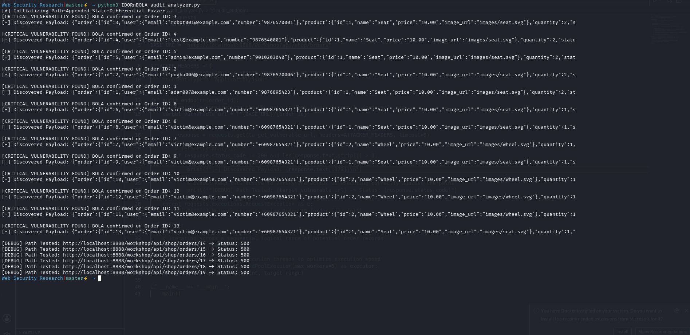

# Multi-Threaded BOLA/IDOR Audit Harness

A high-performance, multi-threaded Python automation framework designed to detect Broken Object Level Authorization (BOLA) and Insecure Direct Object References (IDOR) vulnerabilities within microservice-based REST APIs via state-differential analysis.

## 🛠️ The Core Vulnerability Concept
Broken Object Level Authorization (BOLA) happens when an application relies heavily on user-input object identifiers in API paths or parameters without verifying server-side if the requesting user context owns that specific resource asset row. This tool automates the process of identifying these flaws at scale.

## 🚀 Execution & Architectural Workflow
The script uses `concurrent.futures` to execute parallel state-differential scanning:
1. **Authentication Interception:** Accepts a valid authentication session context token (JWT/Bearer) belonging to a low-privileged user account (the attacker).
2. **Path-Appended Parameter Fuzzing:** Iterates through a variable sequential target scope range (e.g., `/api/shop/orders/{id}`) appending external IDs.
3. **Differential Telemetry Analysis:** Analyzes individual HTTP responses. If a request containing the attacker's token returns an HTTP `200 OK` along with a valid non-empty data schema belonging to another user context, it isolates and highlights the resource leakage.

## 🔬 Lab Validation Environment
The validation testing suite was successfully executed against the **OWASP crAPI (Completely Ridiculous API)** microservice framework hosted locally via Docker Compose containers.
* **Target Discovered Path:** `http://localhost:8888/workshop/api/shop/orders/{id}`
* **Tested Scope Matrix:** Sequential IDs 1 through 20.

### Proof of Concept (PoC) Log:


## 🛡️ Code-Level Remediation Strategy
To properly mitigate this vulnerability, developers must avoid implicitly trusting resource identifiers submitted via client-side parameters. Identity verification should occur directly at the data controller layer:

```python
# SECURE COMPLIANT FIX: Validate session ownership context
@app.route('/api/shop/orders/<order_id>')
@jwt_required()
def get_order_details(order_id):
    current_user_identity = get_jwt_identity() # Server-side validated context
    order = db.fetch_order(order_id)
    
    if order.owner_id != current_user_identity:
        return jsonify({"error": "Access Denied: Unauthorized Context Access"}), 403
        
    return jsonify(order), 200
